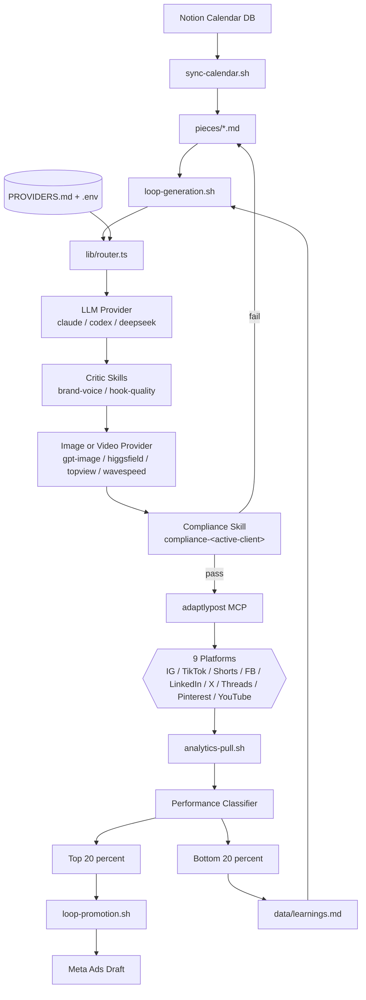
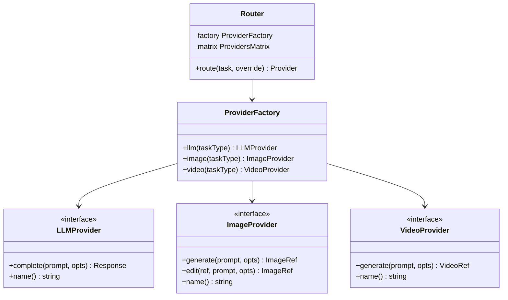

# System Design

## Overview

The Marketing Engine is a provider-agnostic content pipeline that turns a single Notion calendar entry into platform-ready creatives across nine social channels, with a feedback loop that promotes top performers into Meta Ads drafts and learns from underperformers. Every external capability (LLM, image, video, publish, ads) is brokered through `lib/router.ts` and the `PROVIDERS.md` matrix, so swapping a vendor is a configuration change rather than a code rewrite.

## Pipeline

## Provider Abstraction

The factory reads the active task type, looks up the default in `PROVIDERS.md`, applies any per-piece `provider_override`, and instantiates the concrete adapter. Skills only declare task type (`copy-short`, `image-carousel`, `video-reel`) and never mention vendor names.

## Data Flow

| Path | Purpose |
|------|---------|
| `outputs/<piece-id>/` | Final generated assets (mp4, png, captions.json) ready for adaptlypost upload. |
| `outputs/<piece-id>/drafts/` | Intermediate provider responses retained for inspection and rerun. |
| `data/llm-usage.jsonl` | One JSONL line per LLM call: `{timestamp, piece_id, task, provider_used, model, input_tokens, output_tokens, cost_estimate, fallback_used}`. Drives cost dashboards and provider A/B. |
| `data/analytics.jsonl` | One line per platform per piece per pull: `{timestamp, piece_id, platform, reach, impressions, saves, shares, comments, profile_visits, ctr}`. Source for the classifier. |
| `data/learnings.md` | Append-only log of bottom-20 percent post-mortems: hypothesis, hook pattern, format, takeaway. Re-injected into next generation cycle as anti-pattern context. |
| `data/promotions.jsonl` | One line per promoted piece: `{timestamp, piece_id, platform, reason, meta_ads_draft_id}`. |

Date format throughout: ISO-8601 UTC (`YYYY-MM-DDTHH:MM:SSZ`). Piece IDs follow `PIECE-YYYYWww-NNN`.

## Failure Modes

| Failure | Detection | Behavior |
|---------|-----------|----------|
| Primary LLM provider down or 5xx | Adapter throws after retry budget | Router transparently retries on `LLM_FALLBACK` provider; usage log marks `fallback_used=true`. |
| Compliance skill returns `pass=false` | JSON contract from `compliance-<active-client>` (or `compliance-generic`) | Publish blocked; piece status reverts to `review`; violations and suggestions appended to the piece body. |
| Provider quota exhausted (HTTP 429 or rate limit header) | Adapter or response inspection | Pipeline pauses for that provider; pending pieces remain in `scheduled`; alert appended to `data/learnings.md` with timestamp and provider; cron picks up next window. |
| Image or video generation timeout | Adapter timeout | Falls back to alternate provider for the same task type when one is configured (e.g. `wavespeed` for `higgsfield` cinematic), else marks piece `review`. |
| adaptlypost publish failure | MCP error code | Piece kept in `scheduled`, retry counter incremented, exponential backoff. After three failures the piece is moved to `review` with the error transcript. |
| Notion sync conflict (piece edited locally and remotely) | Hash mismatch on `sync-calendar.sh` | Local file wins, remote diff is appended as a comment block at the bottom of the piece for manual reconciliation. |
