# Marketing Engine

> 🇺🇸 English. Leia em português: [README.pt-BR.md](README.pt-BR.md).


Provider-agnostic AI marketing engine. Drop into any project, scan it, generate posts, publish across 9 platforms — all configurable via .env.

[](https://github.com/wesleysimplicio/marketing-engine/actions/workflows/ci.yml)

## Repository visuals

These visuals stay near the top of the README on purpose, so the repository always has a fast visual map for humans and coding agents.

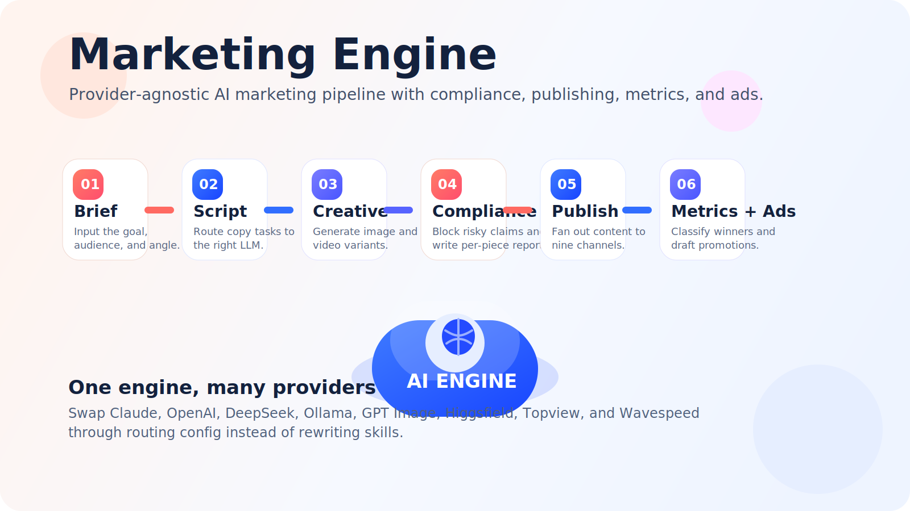

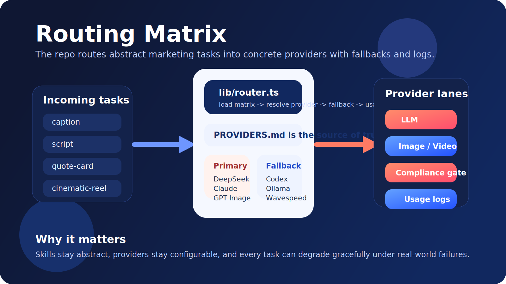

## Watch the skills explainer (90s)

A Remotion-rendered walkthrough of the pipeline and every skill in `.skills/`. Rendered in English; a [Portuguese version](./README.pt-BR.md#veja-o-explainer-das-skills-90s) is also available.

<!--
  GitHub auto-renders a bare https://github.com/<owner>/<repo>/raw/<branch>/...
  URL on its own line as an inline <video controls> player. The URL must
  point at a real branch — using HEAD or a relative path disables the embed.
  Forks should rewrite this URL to their own owner/repo (or remove it and
  rely on the <details> fallback below).
-->
https://github.com/wesleysimplicio/marketing-engine/raw/main/video/out/marketing-engine-skills-en.mp4

<details>
  <summary>Player not loading? Click for the fallback thumbnail / direct download</summary>

  <p align="center">
    <a href="./video/out/marketing-engine-skills-en.mp4">
      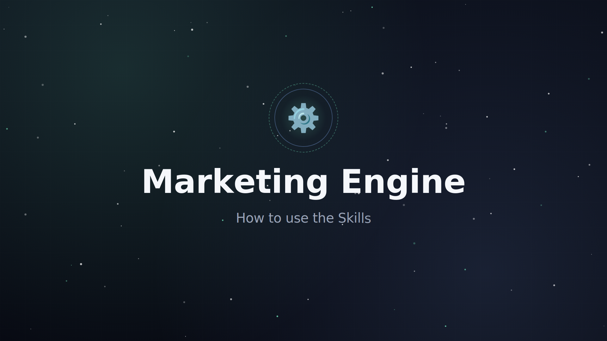
    </a>
  </p>

  <p align="center">
    <a href="./video/out/marketing-engine-skills-en.mp4"><b>▶︎ Open marketing-engine-skills-en.mp4</b></a>
    &nbsp;·&nbsp;
    <a href="./video/README.md">how it was built</a>
  </p>
</details>

### Visual tour of each scene

| Stage | Scene |
|---|---|
| `pipeline` | 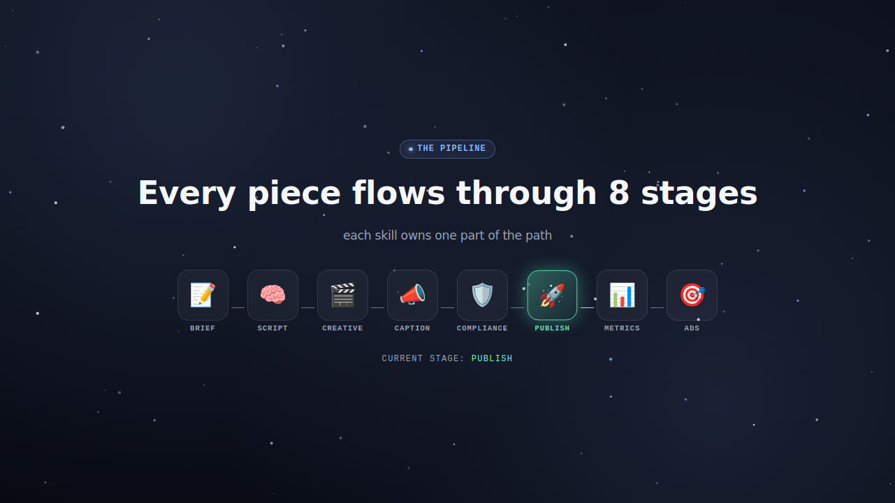 |
| `provider-agnostic` | 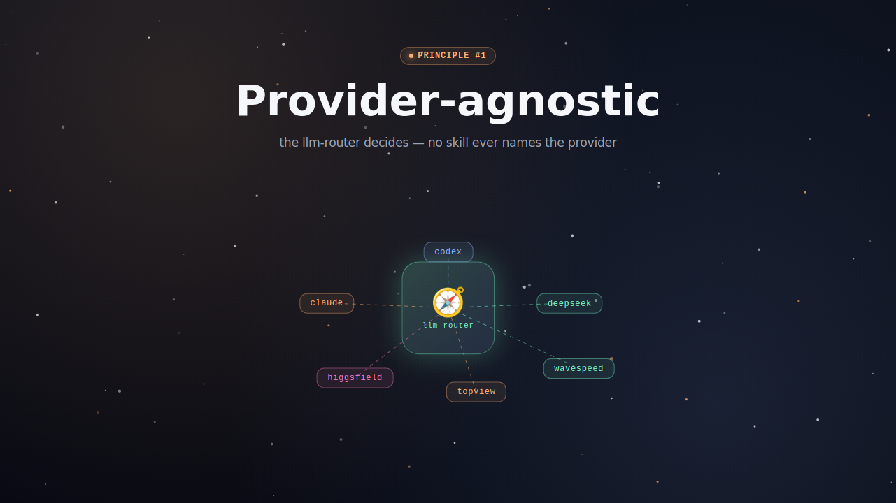 |
| `llm-router` | 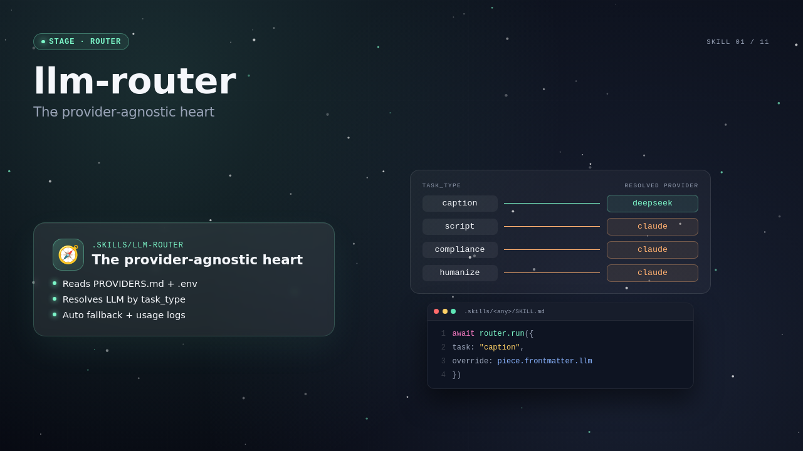 |
| `copywriter-curto` | 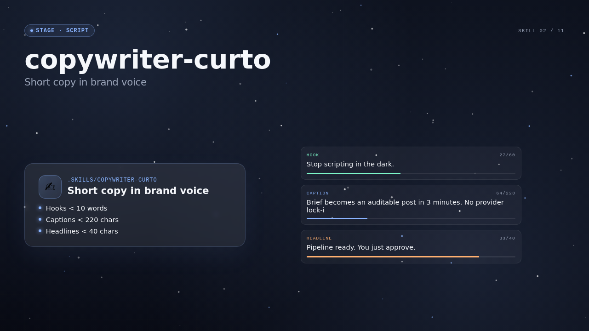 |
| `revisao-humanizada` | 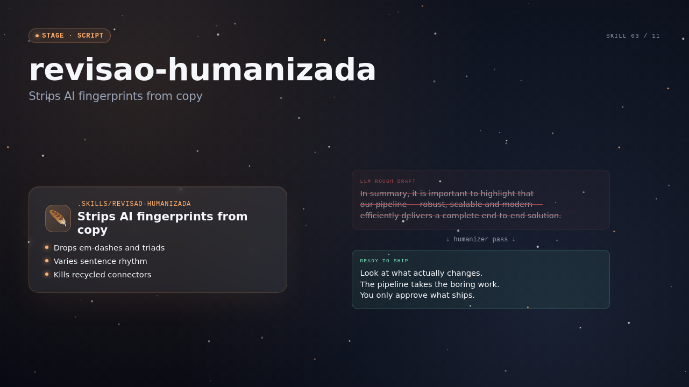 |
| `caption-multi-platform` | 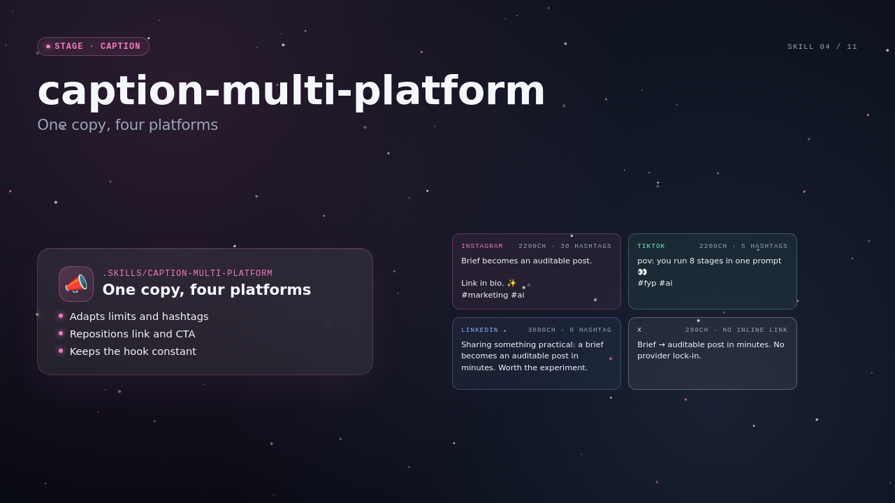 |
| `higgsfield-prompt-builder` | 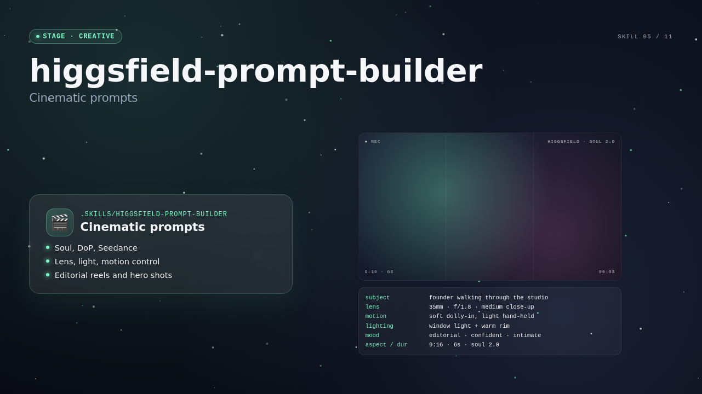 |
| `topview-prompt-builder` | 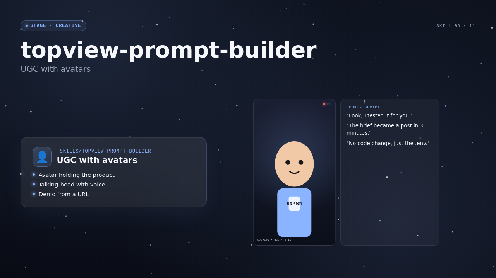 |
| `wavespeed-batch` | 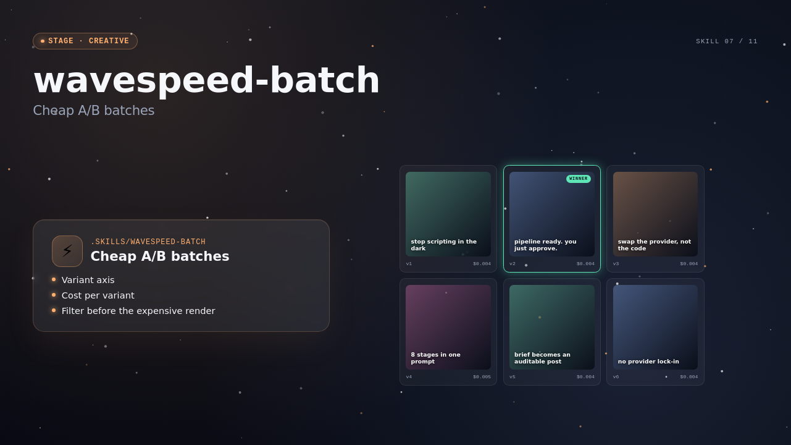 |
| `gpt-image-prompt-builder` | 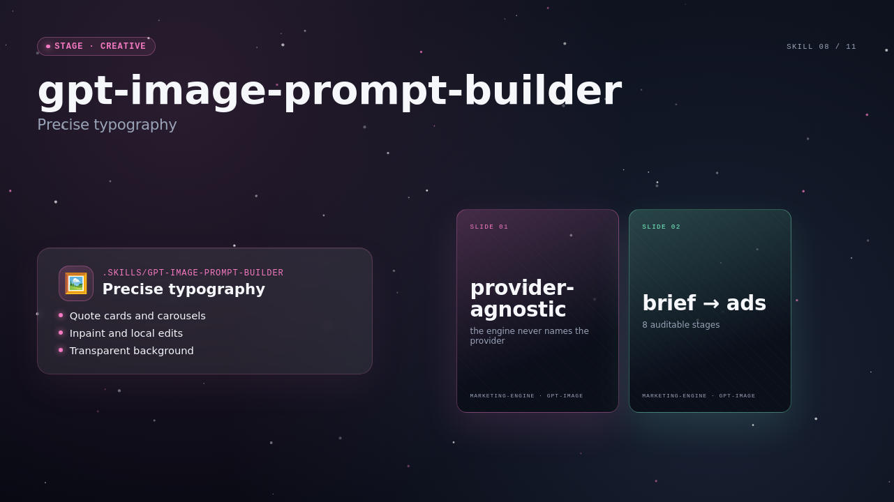 |
| `video-prompt-builder` | 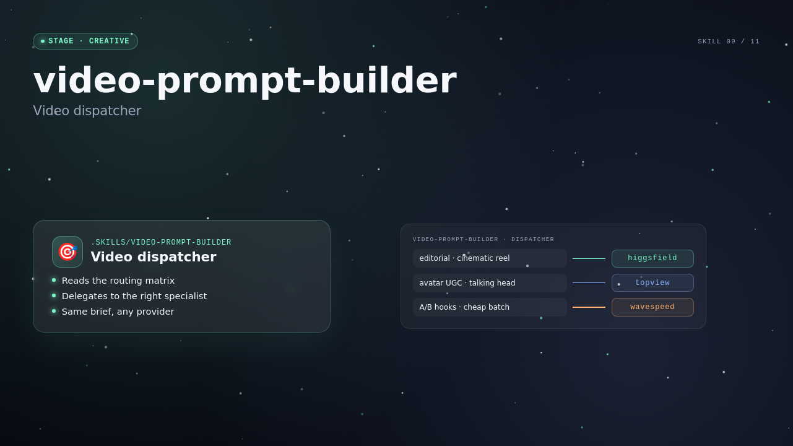 |
| `compliance-generic` | 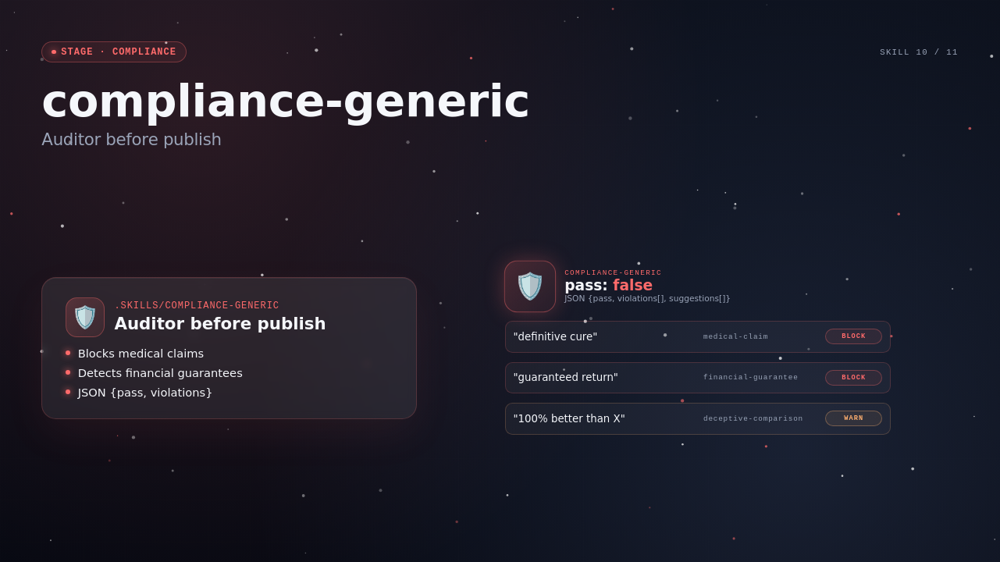 |
| `qa-tech-specs` | 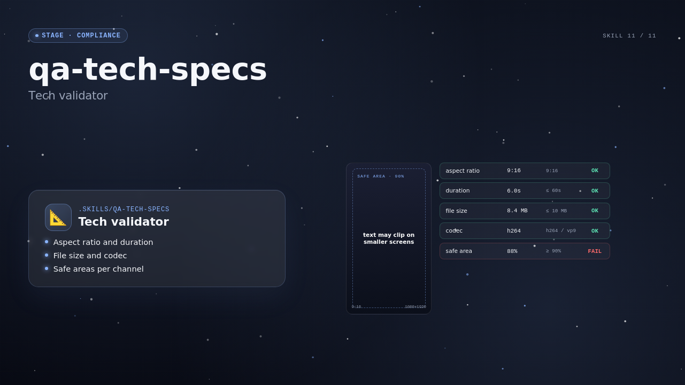 |
| `definition-of-done` | 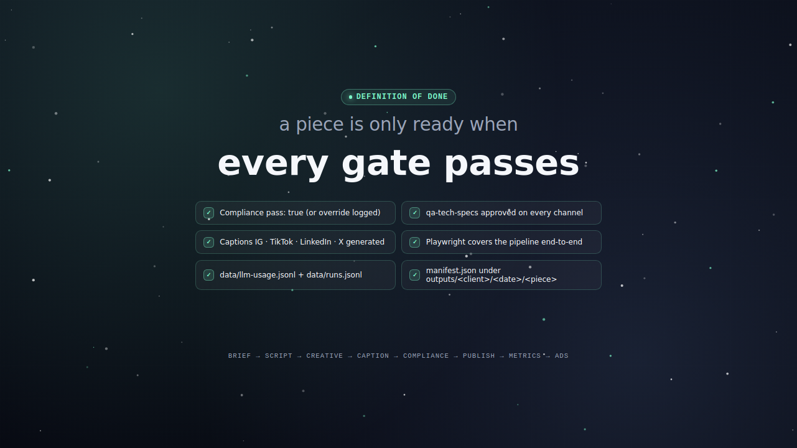 |

### Visual tour of each scene

| Stage | Scene |
|---|---|
| `pipeline` |  |
| `provider-agnostic` |  |
| `llm-router` |  |
| `copywriter-curto` |  |
| `revisao-humanizada` |  |
| `caption-multi-platform` |  |
| `higgsfield-prompt-builder` |  |
| `topview-prompt-builder` |  |
| `wavespeed-batch` |  |
| `gpt-image-prompt-builder` |  |
| `video-prompt-builder` |  |
| `compliance-generic` |  |
| `qa-tech-specs` |  |
| `definition-of-done` |  |

## What it does

- Scans the host project (package.json, README, source tree, existing brand assets) and drafts brand, persona, and content-pillar specs you can review and edit.
- Generates copy through a routed LLM layer (Claude, Codex, DeepSeek, Copilot, Ollama) chosen per task type.
- Generates images and videos through routed providers (gpt-image, Higgsfield, TopView, Wavespeed) selected by content format.
- Runs a compliance audit before any publish action and blocks pieces that fail the gate.
- Publishes the 4-platform caption set through AdaptlyPost (Instagram, TikTok, Facebook, LinkedIn, X, Threads, Pinterest, Shorts, YouTube — 9 platforms total).
- Pulls analytics on a schedule, classifies top performers, and drafts Meta Ads campaigns from the winners.

## Quick start

```
cd /path/to/your-project
npx marketing-engine init
cp .marketing-engine/.env.example .marketing-engine/.env
# fill ANTHROPIC_API_KEY at minimum
npx marketing-engine check
npx marketing-engine generate    # DRY_RUN by default
```

## Why provider-agnostic

No provider is hardcoded. `PROVIDERS.md` plus `.env` decide which LLM, image, or video service handles each task. Switching providers is one env change, not a refactor. Skills declare an abstract `task_type` (`copy-short`, `image-carousel`, `video-reel`); the router resolves the concrete vendor at runtime and applies fallback automatically.

## Stack supported

| Layer | Providers (default first) |
|---|---|
| LLM | claude, codex, deepseek, copilot, ollama |
| Image | gpt-image, higgsfield, topview, wavespeed |
| Video | higgsfield, topview, wavespeed |
| Publishing | adaptlypost (9 platforms) |
| Ads | meta-ads |

Routing rules and rationale live in [.specs/architecture/PROVIDERS.md](./.specs/architecture/PROVIDERS.md).

## CLI commands

| Command | What it does |
|---|---|
| `init` | Scaffold `.marketing-engine/` in host project |
| `scan` | Re-scan host project to refresh draft specs |
| `check` | Validate provider env keys |
| `generate` | Run generation loop (DRY_RUN-safe) |
| `promote` | Run promotion loop |

## Architecture

Pipeline: `brief → script → creative → caption → compliance → publish → metrics → ads`. The router brokers every external call so vendor swaps stay configuration-only.

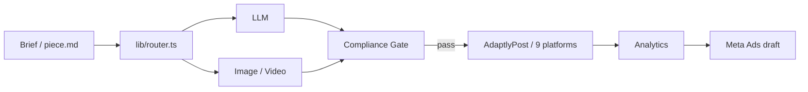

Full design: [.specs/architecture/DESIGN.md](./.specs/architecture/DESIGN.md).

## Project mapping

This repository now ships with an applied [llm-project-mapper](https://github.com/wesleysimplicio/llm-project-mapper) overlay so agents and contributors get an operational map by default.

- Entry docs: [AGENTS.md](./AGENTS.md), [PRD.md](./PRD.md), [PROGRESS.md](./PROGRESS.md), [GOAL_RESULT.md](./GOAL_RESULT.md)
- Mapper-owned operational docs: [docs/local-setup.md](./docs/local-setup.md), [docs/domain-map.md](./docs/domain-map.md), [docs/architecture-map.md](./docs/architecture-map.md), [docs/troubleshooting.md](./docs/troubleshooting.md), [docs/release-readiness.md](./docs/release-readiness.md)
- Agent overlays: [.agents/README.md](./.agents/README.md), [.claude/settings.json](./.claude/settings.json), [INIT.md](./INIT.md)

## Repo layout

```
.specs/        # product, architecture, workflow, sprints — canonical docs
.skills/       # reusable skills (provider-neutral)
.ralph/        # operational scripts (loops, sync, checks)
lib/           # router + provider adapters + publish + ads
bin/           # CLI entry (marketing-engine.mjs)
e2e/           # Playwright specs
```

Setup details: [SETUP.md](./SETUP.md). Agent contract and Definition of Done: [AGENTS.md](./AGENTS.md).

## Develop

```
npm install
npm run typecheck
npm run test:e2e
node bin/marketing-engine.mjs help
```

## Contributing

See [CONTRIBUTING.md](./CONTRIBUTING.md). Issues and PRs welcome. Conventional commits required. CI must pass DoD checks before merge.

## License

Apache-2.0. See [LICENSE](./LICENSE).
