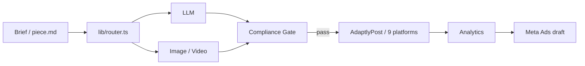

# Marketing Engine

Provider-agnostic AI marketing engine. Drop into any project, scan it, generate posts, publish across 9 platforms — all configurable via .env.

[](https://github.com/wesleysimplicio/marketing-engine/actions/workflows/ci.yml)

## What it does

- Scans the host project (package.json, README, source tree, existing brand assets) and drafts brand, persona, and content-pillar specs you can review and edit.
- Generates copy through a routed LLM layer (Claude, Codex, DeepSeek, Copilot, Ollama) chosen per task type.
- Generates images and videos through routed providers (gpt-image, Higgsfield, TopView, Wavespeed) selected by content format.
- Runs a compliance audit before any publish action and blocks pieces that fail the gate.
- Publishes the 4-platform caption set through AdaptlyPost (Instagram, TikTok, Facebook, LinkedIn, X, Threads, Pinterest, Shorts, YouTube — 9 platforms total).
- Pulls analytics on a schedule, classifies top performers, and drafts Meta Ads campaigns from the winners.

## Quick start

```
cd /path/to/your-project
npx marketing-engine init
cp .marketing-engine/.env.example .marketing-engine/.env
# fill ANTHROPIC_API_KEY at minimum
npx marketing-engine check
npx marketing-engine generate    # DRY_RUN by default
```

## Why provider-agnostic

No provider is hardcoded. `PROVIDERS.md` plus `.env` decide which LLM, image, or video service handles each task. Switching providers is one env change, not a refactor. Skills declare an abstract `task_type` (`copy-short`, `image-carousel`, `video-reel`); the router resolves the concrete vendor at runtime and applies fallback automatically.

## Stack supported

| Layer | Providers (default first) |
|---|---|
| LLM | claude, codex, deepseek, copilot, ollama |
| Image | gpt-image, higgsfield, topview, wavespeed |
| Video | higgsfield, topview, wavespeed |
| Publishing | adaptlypost (9 platforms) |
| Ads | meta-ads |

Routing rules and rationale live in [.specs/architecture/PROVIDERS.md](./.specs/architecture/PROVIDERS.md).

## CLI commands

| Command | What it does |
|---|---|
| `init` | Scaffold `.marketing-engine/` in host project |
| `scan` | Re-scan host project to refresh draft specs |
| `check` | Validate provider env keys |
| `generate` | Run generation loop (DRY_RUN-safe) |
| `promote` | Run promotion loop |

## Architecture

Pipeline: `brief → script → creative → caption → compliance → publish → metrics → ads`. The router brokers every external call so vendor swaps stay configuration-only.



Full design: [.specs/architecture/DESIGN.md](./.specs/architecture/DESIGN.md).

## Repo layout

```
.specs/        # product, architecture, workflow, sprints — canonical docs
.skills/       # reusable skills (provider-neutral)
.ralph/        # operational scripts (loops, sync, checks)
lib/           # router + provider adapters + publish + ads
bin/           # CLI entry (marketing-engine.mjs)
e2e/           # Playwright specs
```

Setup details: [SETUP.md](./SETUP.md). Agent contract and Definition of Done: [AGENTS.md](./AGENTS.md).

## Develop

```
npm install
npm run typecheck
npm run test:e2e
node bin/marketing-engine.mjs help
```

## Contributing

See [CONTRIBUTING.md](./CONTRIBUTING.md). Issues and PRs welcome. Conventional commits required. CI must pass DoD checks before merge.

## License

Apache-2.0. See [LICENSE](./LICENSE).
