# Marketing Engine

> 🇧🇷 Versão em português. Read this in English: [README.md](README.md).

Engine de marketing AI provider-agnostic. Cai em qualquer projeto, escaneia, gera posts, publica em 9 plataformas — tudo configurável via `.env`.

[](https://github.com/wesleysimplicio/marketing-engine/actions/workflows/ci.yml)

## Veja o explainer das skills (90s)

Um walkthrough renderizado em Remotion do pipeline e de cada skill em `.skills/`. Renderizado em português; uma [versão em inglês](./README.md#watch-the-skills-explainer-90s) também está disponível.

<p align="center">
  <a href="./video/out/marketing-engine-skills.mp4">
    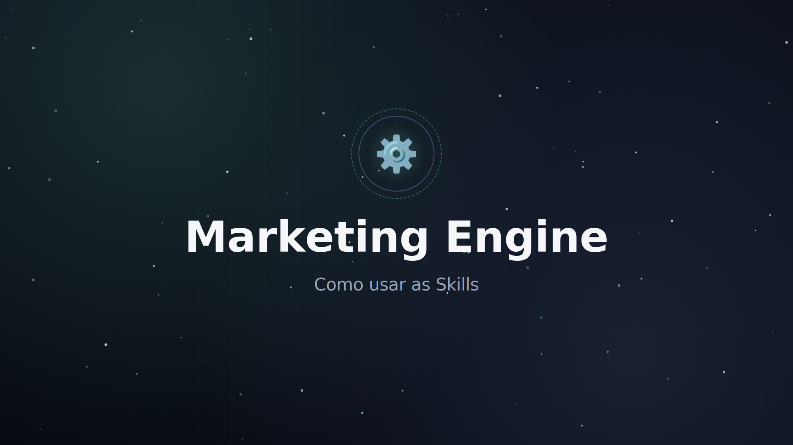
  </a>
</p>

<p align="center">
  <a href="./video/out/marketing-engine-skills.mp4"><b>▶︎ Tocar marketing-engine-skills.mp4</b></a>
  &nbsp;·&nbsp;
  <a href="./video/README.md">como foi feito</a>
</p>

### Tour visual cena a cena

| Etapa | Cena |
|---|---|
| `pipeline` | 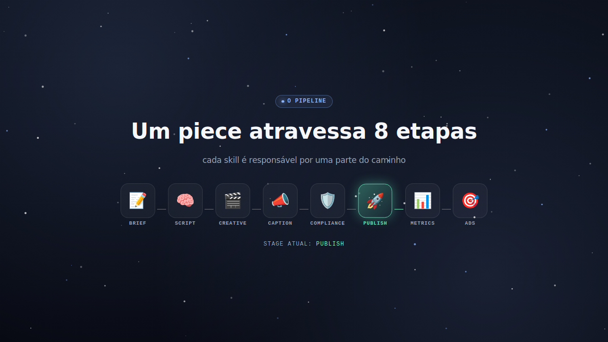 |
| `provider-agnostic` | 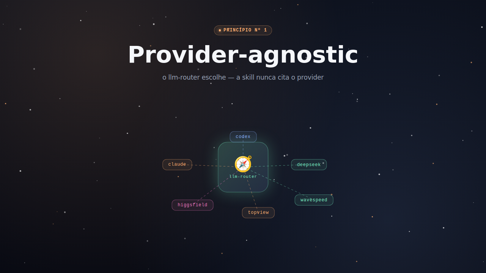 |
| `llm-router` | 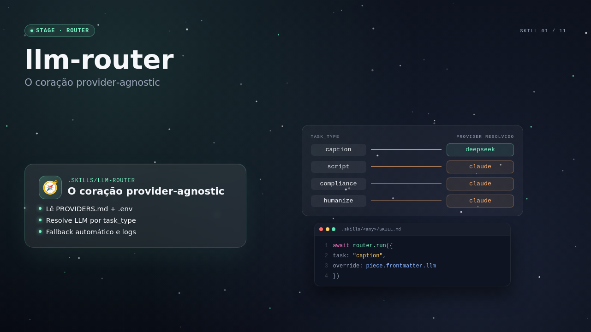 |
| `copywriter-curto` | 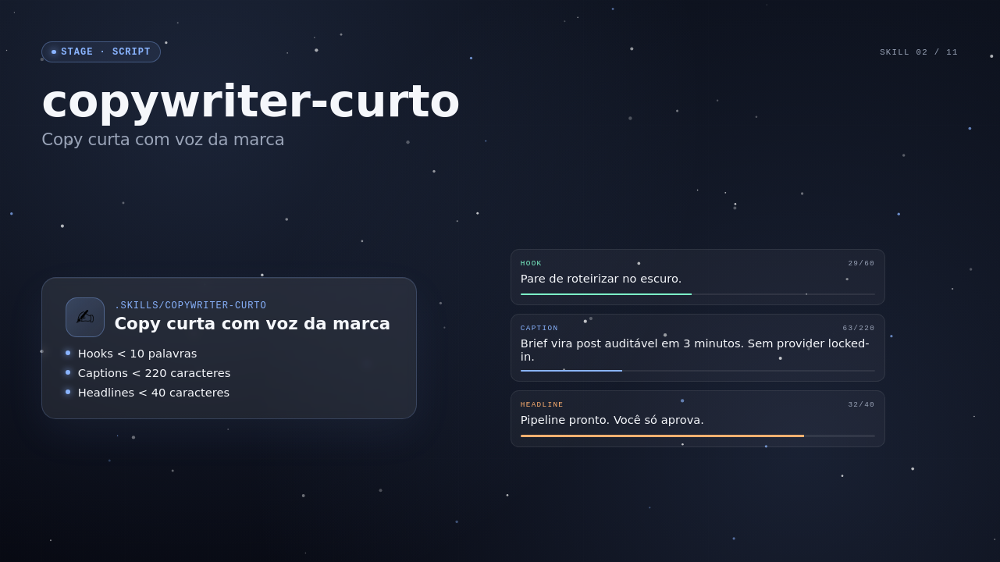 |
| `revisao-humanizada` |  |
| `caption-multi-platform` | 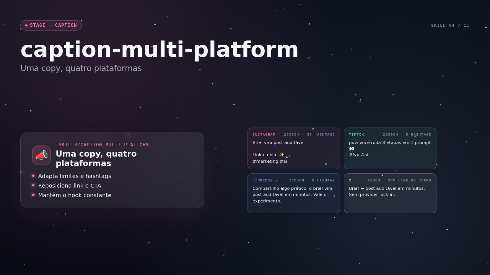 |
| `higgsfield-prompt-builder` | 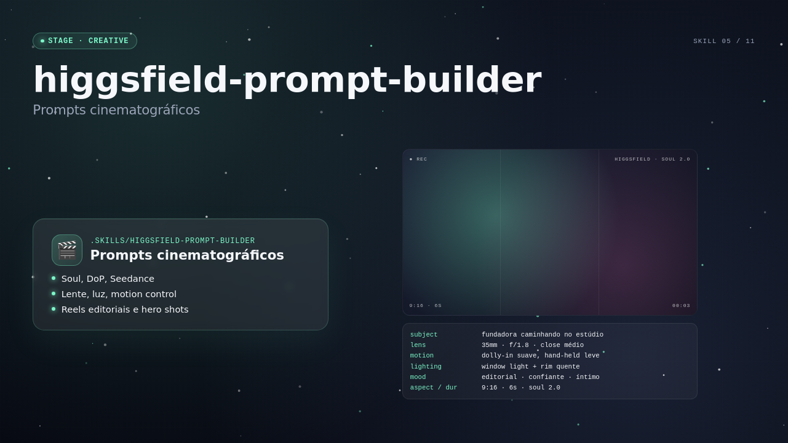 |
| `topview-prompt-builder` | 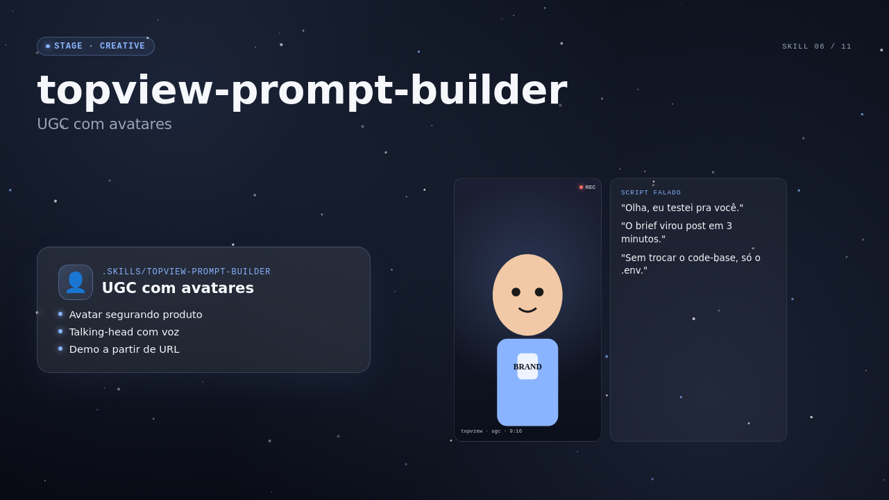 |
| `wavespeed-batch` | 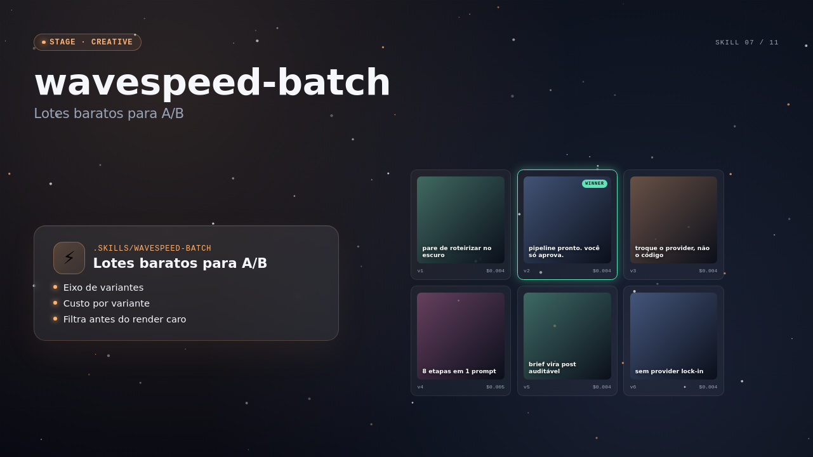 |
| `gpt-image-prompt-builder` | 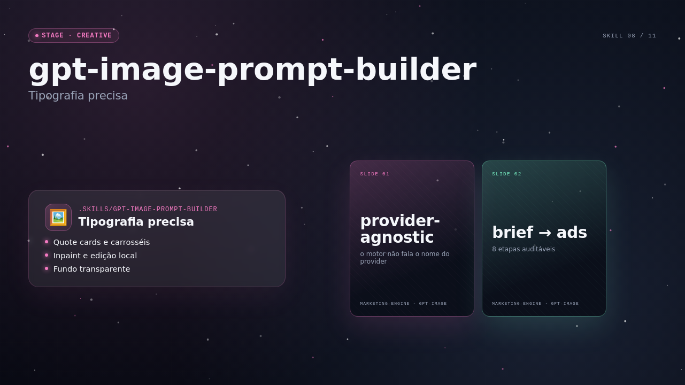 |
| `video-prompt-builder` | 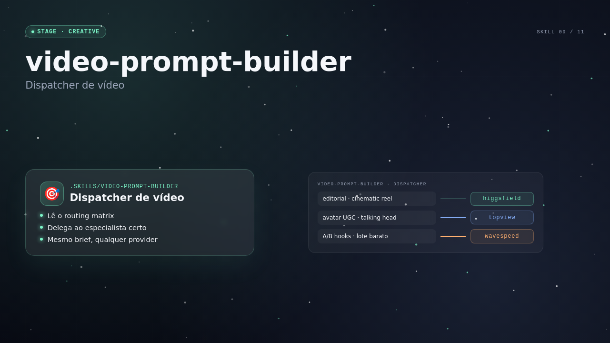 |
| `compliance-generic` | 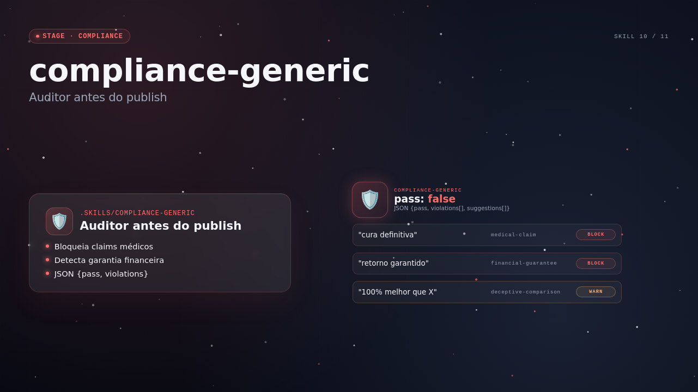 |
| `qa-tech-specs` | 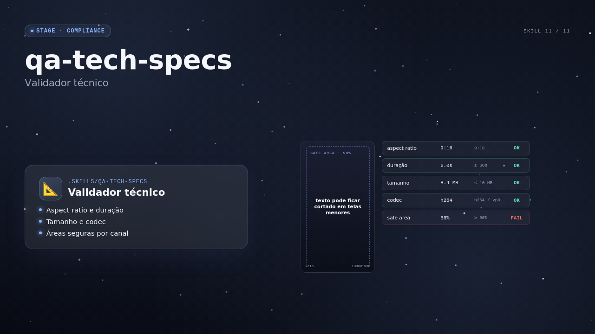 |
| `definition-of-done` | 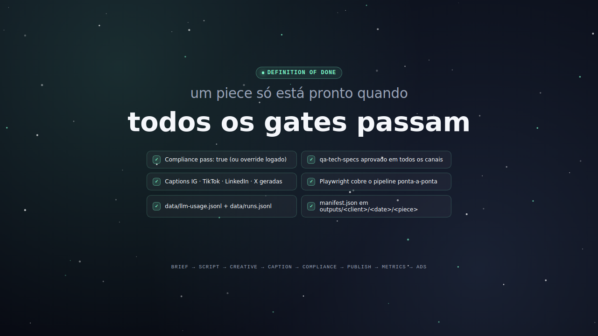 |

## O que faz

- Escaneia o projeto host (`package.json`, README, árvore de fontes, assets de marca existentes) e rascunha brand, persona e content-pillar specs pra você revisar.
- Gera copy via camada LLM roteada (Claude, Codex, DeepSeek, Copilot, Ollama) escolhida por task type.
- Gera imagens e vídeos via providers roteados (gpt-image, Higgsfield, TopView, Wavespeed) selecionados por formato.
- Roda audit de compliance antes de qualquer publish e bloqueia peças que falham no gate.
- Publica caption set de 4 plataformas via AdaptlyPost (Instagram, TikTok, Facebook, LinkedIn, X, Threads, Pinterest, Shorts, YouTube — 9 ao total).
- Puxa analytics em schedule, classifica top performers, rascunha campanhas Meta Ads dos vencedores.

## Quick start

```
cd /caminho/do/seu-projeto
npx marketing-engine init
cp .marketing-engine/.env.example .marketing-engine/.env
# preencha ANTHROPIC_API_KEY no mínimo
npx marketing-engine check
npx marketing-engine generate    # DRY_RUN por default
```

## Por que provider-agnostic

Nenhum provider é hardcoded. `PROVIDERS.md` + `.env` decidem qual LLM, image ou video service trata cada task. Trocar provider é uma mudança de env, não refactor. Skills declaram `task_type` abstrato (`copy-short`, `image-carousel`, `video-reel`); o router resolve o vendor concreto em runtime e aplica fallback automático.

## Stack suportada

| Camada | Providers (default primeiro) |
|---|---|
| LLM | claude, codex, deepseek, copilot, ollama |
| Image | gpt-image, higgsfield, topview, wavespeed |
| Video | higgsfield, topview, wavespeed |
| Publishing | adaptlypost (9 plataformas) |
| Ads | meta-ads |

Regras de roteamento e racional em [.specs/architecture/PROVIDERS.md](./.specs/architecture/PROVIDERS.md).

## Comandos CLI

| Comando | O que faz |
|---|---|
| `init` | Faz scaffold do `.marketing-engine/` no projeto host |
| `scan` | Re-escaneia o projeto host pra atualizar specs draft |
| `check` | Valida chaves de env dos providers |
| `generate` | Roda loop de geração (DRY_RUN-safe) |
| `promote` | Roda loop de promoção |

## Arquitetura

Pipeline: `brief → script → creative → caption → compliance → publish → metrics → ads`. O router faz broker de toda chamada externa pra que troca de vendor seja só config.

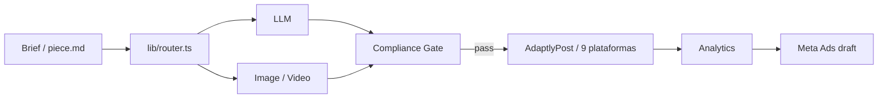

Design completo: [.specs/architecture/DESIGN.md](./.specs/architecture/DESIGN.md).

## Layout do repo

```
.specs/        # product, architecture, workflow, sprints — docs canônicas
.skills/       # skills reutilizáveis (provider-neutral)
.ralph/        # scripts operacionais (loops, sync, checks)
lib/           # router + adapters de provider + publish + ads
bin/           # entry da CLI (marketing-engine.mjs)
e2e/           # specs Playwright
```

Detalhes de setup: [SETUP.md](./SETUP.md). Contrato com agente e Definition of Done: [AGENTS.md](./AGENTS.md).

## Desenvolver

```
npm install
npm run typecheck
npm run test:e2e
node bin/marketing-engine.mjs help
```

## Contribuindo

Veja [CONTRIBUTING.md](./CONTRIBUTING.md). Issues e PRs bem-vindos. Conventional commits obrigatórios. CI tem que passar checks de DoD antes do merge.

## Licença

Apache-2.0. Veja [LICENSE](./LICENSE).
